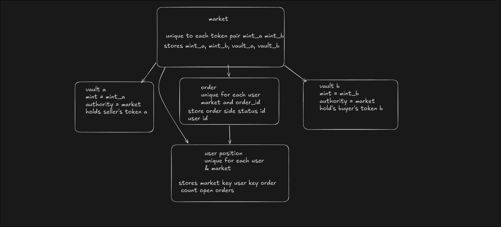
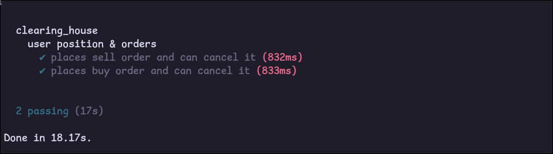

# Clearing House – Simplified On-Chain Order Matching Engine

A trustless limit order book on Solana using Anchor. Users place buy/sell limit orders, lock collateral in program-owned vaults, match orders permissionlessly, and cancel with full refund.

**Deployed on devnet**  
**Program ID:** `5pjD2YK4DCZnvQt3SnB9fwmmhxFyubBrBMuQitd3Kyz5`  
**IDL Account:** `BysMs9iQj2B7JJpYrVMXqn1yWvLioNsdz9puSWYXmgWT`  
**Deploy Transaction:** [https://explorer.solana.com/tx/5De7NUqyK8LkikeUNb6tBQVDQK9habWawJeTbVssgKncfuauXjhacTgv6CNxznftrmZj9ubMmTNPQ9t2GCjC3fmu?cluster=devnet](https://explorer.solana.com/tx/5De7NUqyK8LkikeUNb6tBQVDQK9habWawJeTbVssgKncfuauXjhacTgv6CNxznftrmZj9ubMmTNPQ9t2GCjC3fmu?cluster=devnet)

## Features
- Trustless limit orders (buy/sell) with full collateral locking
- Permissionless matching (anyone can call `match_order`)
- Instant cancel with refund of locked funds
- Per-user position tracking (open orders count)
- Secure PDA-based authority (no central custodian)

## Architecture & Account Model

The program uses deterministic PDAs for trustless, collision-free state management.



**Key accounts:**
- **Market** PDA `[market, mint_a, mint_b]` — unique per sorted token pair, owns vaults
- **Vault A/B** ATAs — hold locked collateral, authority = Market PDA (program signs via seeds)
- **Order** PDA `[order, user, market, order_id]` — per user + market + incremental ID
- **User Position** PDA `[user_position, user, market]` — tracks order count & open orders

This design ensures secure authority delegation, no central operator, and verifiable ownership.

## Code Quality & Rust Patterns
- Full Anchor usage: constraints, bumps, CPI with signer seeds
- Safe math: u128 intermediates, overflow checks
- Custom errors with early returns
- Clear separation: market state, user position, per-order state
- No unsafe code, modular & auditable

## Correctness & Testing
Comprehensive Anchor tests covering core flows:
- Place & cancel sell order → collateral locked & refunded
- Place & cancel buy order → payment locked & refunded
- Match valid buy/sell pair → correct transfers, refunds, status update
- Invalid cases (zero amount, same side)

All tests passing locally:



## Web2 → Solana Design Analysis
**Web2 centralized order book**  
- Orders stored in DB tables  
- Matching engine off-chain (fast, low latency)  
- Funds held by custodian/exchange → trust required  
- Easy to add features (partial fills, advanced order types)

**Solana on-chain version**  
- Orders = PDAs (immutable, verifiable on-chain)  
- Collateral locked in program-owned vaults  
- Matching permissionless (anyone calls `match_order`)  
- Trustless, auditable, no custodian risk

**Tradeoffs**  
- Trustless & censorship-resistant vs centralized speed/cost  
- CU limits → simple matching only (no complex order book)  
- Full collateral lock → secure but capital inefficient  
- Immutable logic → hard to upgrade (future proxy possible)

## UX / Client Usability
Deployed program is publicly verifiable on Solana Explorer.

Basic interaction via Anchor CLI or custom script:

```bash
# Example: place buy order
anchor run place-order --side buy --price 100 --amount 100000000

# View order on explorer
https://explorer.solana.com/address/ORDER_PDA_HERE?cluster=devnet
